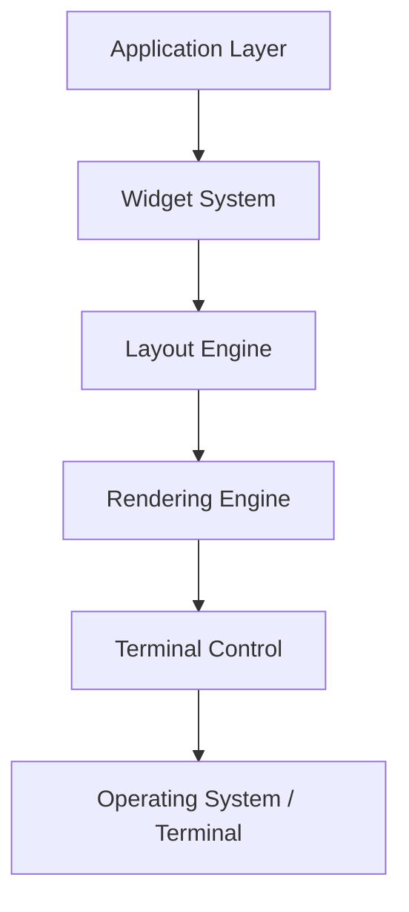

# TUI Framework Architecture for Node.js/TypeScript

This document outlines the design and technical specifications for a sophisticated, production-grade Terminal User Interface (TUI) framework built in Node.js with TypeScript. The framework must demonstrate mastery of low-level terminal control and deliver robust, extensible architecture suitable for complex real-world applications.

## 1. High-Level Overview

Below is a conceptual view of the major layers:

• **Terminal Control**: Manages raw terminal interactions, ANSI codes, mouse tracking, raw mode toggling. 
• **Rendering Engine**: Performs double buffering, tracks screen cells, renders changes.
• **Layout Engine**: Manages constraints and responsive layouts.
• **Widget System**: Provides user-facing components, lifecycle management.
• **Application Layer**: Encapsulates business logic and application state.

## 2. Terminal Control Layer

1. **ANSI Escape Code API**: A dedicated utility module that provides:
   - Functions for cursor movement (`moveCursor(x, y)`), color updates, text styling, screen clearing.
   - Low-level raw writes to stdout for performance.

2. **Terminal Detection & Capability**:
   - Query and store terminal dimensions, environment variables (e.g., `$TERM`).
   - Fallback logic if certain features are unavailable.

3. **Raw Mode Management**:
   - Automatically toggles raw mode on program start, reverts to cooked mode on exit.
   - Handles signals that might interrupt terminal state.

4. **Mouse Tracking**:
   - Supports SGR (1006), UTF-8, X10 modes.
   - Provides APIs to enable or disable mouse event reporting.

## 3. Rendering Engine

1. **Double Buffering**:
   - Maintain two in-memory buffers of screen content (front and back) to minimize flicker.
   - Only send diffs between the back buffer and front buffer to the terminal.

2. **Screen Cell Structure**:
   - Each cell stores a character, foreground color, background color, and styling flags.
   - Changes at granularity of individual cells.

3. **Differential Rendering**:
   - Track changed regions of the buffer.
   - Overhead reduction by grouping changes to reduce excessive ANSI calls.

4. **Performance Optimization**:
   - Batch and flush updates at discrete intervals.
   - Use minimal escape sequences for large areas (e.g., clearing lines vs. rewriting each cell).

## 4. Event Loop System

1. **Non-Blocking I/O**:
   - Leverage Node.js streams for reading from stdin and writing to stdout.
   - Use event-driven approach for user input handling.

2. **Event Queue Design**:
   - A central queue collects keyboard, mouse, and system events.
   - Synchronous or asynchronous dispatch to the application.

3. **Debouncing & Throttling**:
   - Combine high-frequency input events (mouse, rapid keystrokes) to reduce unnecessary re-renders.

4. **Signal Handling**:
   - Capture signals (`SIGWINCH` for terminal resize, `SIGINT`/`SIGTERM` for graceful shutdown).
   - Expose callbacks so the application can respond or do cleanup.

## 5. Layout Engine

1. **Flexbox-Like Layout**:
   - Container-based approach with direction, alignment, and wrapping.
   - Automatic dimension calculation using min/max constraints.

2. **Constraint-Based Resolution**:
   - Resolve final positions and sizes based on child requirements.
   - Overflow handling for smaller terminal sizes.

3. **Resize Handling**:
   - Hook into `SIGWINCH` to recalculate layout when the terminal is resized.

4. **Responsive Adaptation**:
   - Optional breakpoints or ratio-based scaling.

## 6. Widget System

1. **Component Lifecycle**:
   - `mount`: widget is attached to the hierarchy.
   - `update`: widget’s props or state changes.
   - `unmount`: widget is removed.

2. **Prop & State Management**:
   - Immutable state objects.
   - Unidirectional data flow from parent to child.

3. **Event Handling**:
   - Propagate input events through a hierarchy.
   - Delegation layer for focusing and receiving keyboard events.

4. **Focus Management**:
   - Track which widget is currently active.
   - Provide navigational patterns for tabbing or arrow keys.

## 7. Data Visualization

1. **Real-Time Charts**:
   - Provide specialized widgets for line charts, bar charts, spark lines.
   - Efficient redrawing of only changed data points.

2. **Canvas-Like Abstraction**:
   - Optional immediate-mode rendering APIs for custom shapes.
   - Automatic layering with other components.

3. **Animation Frame System**:
   - Throttle or batch animations to optimize.
   - Provide hooks for application-driven redraw cycles.

4. **Performance Considerations**:
   - Minimally redraw stable chart areas.
   - Efficient text-based rendering for large data sets.

## 8. Async Task System

1. **Background Task Queue**:
   - Managed asynchronously so UI remains responsive.
   - Avoids blocking event loop.

2. **Worker Thread Integration**:
   - Offload CPU-intensive tasks.
   - Provide message-based communication with TUI.

3. **Progress Reporting**:
   - Expose a standard interface for tasks to report partial progress.
   - UI can reflect progress in real-time.

4. **Cancellation & Timeouts**:
   - Cooperative cancellation signals from the user interface.
   - Configurable task timeouts.

## 9. Color System

1. **TrueColor (24-bit)**:
   - Full range of RGB colors for foreground/background.
   - Fallback to 8-bit or 16-color if terminal lacks support.

2. **Color Palette & Themes**:
   - Theming engine to standardize color usage across widgets.
   - Dynamically switch color schemes at runtime.

3. **Color Space Conversions**:
   - Utility functions for converting between RGB and HSL.
   - Potential grayscale conversions for accessibility.

4. **Accessibility Considerations**:
   - Provide recommended color contrasts.
   - Support a high-contrast mode.

## 10. Accessibility

1. **Screen Reader Output**:
   - Alternative text-based output that screen readers can interpret.
   - Potentially replicate the data in a linear text format.

2. **High Contrast Mode**:
   - Custom color palette ensuring strong contrast.
   - Toggle approach for easy accessibility support.

3. **Keyboard Navigation Patterns**:
   - Provide consistent structure for tab, arrow keys, shortcuts.
   - Ensure all actions can be triggered without a mouse.

4. **Focus Indicators**:
   - Widget-level highlighting or bounding to show focus visually.

## Additional Considerations

### Data Flow
Application state flows down (immutable data structures), events flow up. The event loop dispatches input to the active widget or bubbled up to the parent if unhandled.

### Memory Management
- Avoid holding large screen buffers in memory via partial or incremental storage. 
- Use pooled objects or other reuse strategies where feasible.

### Error Handling Strategy
- Central error bus logs terminal usage metrics, preventing raw mode from being left enabled.
- Provide fallback rendering on unhandled exceptions.

### Testing Strategy
1. **Unit Testing**
   - Each layer tested in isolation.
   - Mock terminal interactions.
2. **Integration Testing**
   - Simulate event loop, rendering, and user input.
3. **Snapshot Testing**
   - Compare screen buffers to known good outputs.
4. **Performance Benchmarking**
   - Repeated stress tests with complex layouts and frequent updates.

## Summary
The proposed TUI framework will rely on a modular structure with these layers:
1. **Terminal Control** for raw I/O, ANSI codes, raw mode control.
2. **Rendering Engine** with double buffering and differential rendering.
3. **Layout Engine** for constraint-based, flexbox-like arrangement.
4. **Widget System** with component lifecycle patterns.
5. **Application Layer** for integrating business logic and states.

Using unidirectional data flow and immutability fosters robust, testable code. The architecture includes advanced features like real-time data visualization, accessibility, background tasks, and multiple color modes. By minimizing overhead and carefully separating responsibilities, the framework should be performant enough for large-scale terminal applications.
